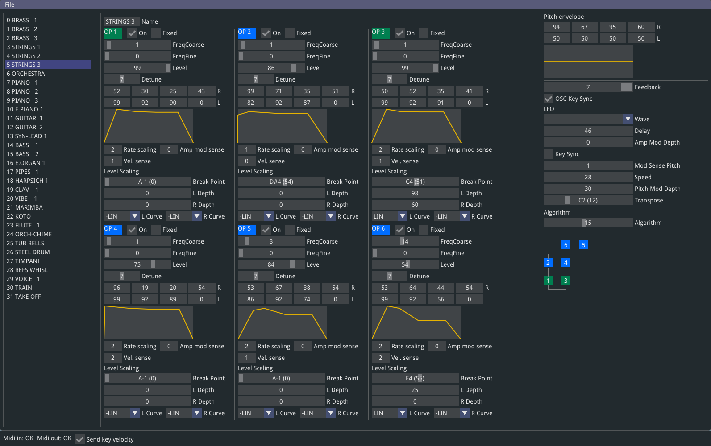

# Volcako

This is a realtime editor for the Korg Volca FM. It exposes all of Volca's parameters in one ~~ugly~~ functional screen. In addition it can load and save entire 32 voice banks in .SYX format. If you have a midi input device connected, the keypresses will be routed to Volca, optionally with note velocity!



Some nice to know things:
- Right click on an envelope to copy/paste the values
- Control-click on an input field to type in the value
- The last edited present is auto-saved/loaded into lastpreset.txt

Windows release can be found at: https://github.com/Luomu/volcako/releases/download/r1/volcako-r1.zip

## Building

Only a Windows build has been made so far. However, all the libraries used are cross platform so a Mac/Linux port should be a breeze.

First you need to generate the makefile/solution for the IDE of your choice. For that we use [Genie](https://github.com/bkaradzic/genie). To create .sln for VS 2019, run this in the root directory:

```genie vs2019```

Precompiled Windows executable: https://github.com/bkaradzic/bx/raw/master/tools/bin/windows/genie.exe

## Libraries used
dear imgui - https://github.com/ocornut/imgui

glfw - www.glfw.org/

gl3w - https://github.com/skaslev/gl3w

inipp - https://github.com/mcmtroffaes/inipp

rtmidi - www.music.mcgill.ca/~gary/rtmidi/

tinyfiledialogs - https://sourceforge.net/projects/tinyfiledialogs/

## References
Korg Volca FM Midi implementation - www.korg.com/us/support/download/manual/0/558/2963/

## Thanks to
Dexed - https://asb2m10.github.io/dexed/ - DX7 VST and editor, used to verify Sysex compatibility
